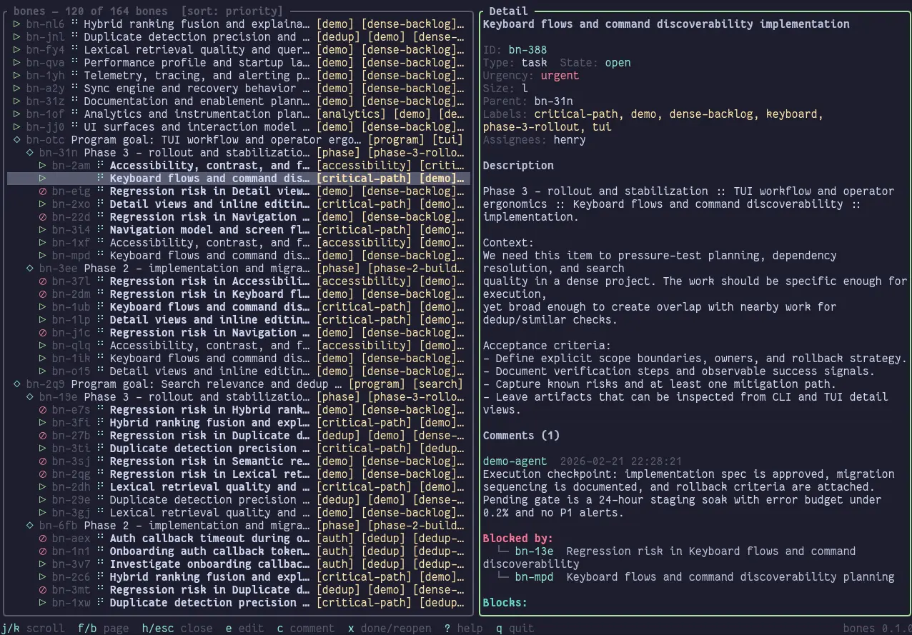
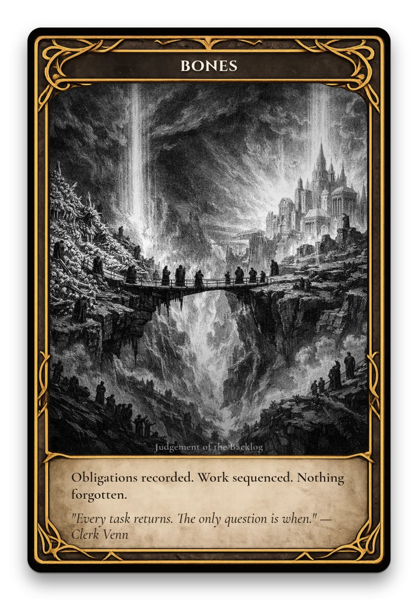

# bones



bones is a CRDT-native issue tracker for distributed human and agent collaboration.

It is designed for teams where multiple people and coding agents are editing the same backlog concurrently, and where machine-readable CLI output matters as much as human UX.

## Why bones exists

bones is heavily inspired by great prior work:

- [`beads`](https://github.com/steveyegge/beads) by Steve Yegge
- [`beads_viewer`](https://github.com/Dicklesworthstone/beads_viewer) by Jeffrey Emanuel

Those tools proved that agent-oriented issue tracking and robot triage workflows are practical. bones builds on that direction with a different storage/convergence architecture and a unified CLI/TUI surface.

The short version:

- **beads**: strong issue/workflow model.
- **beads_viewer**: rich `--robot-*` triage/reporting interface.
- **bones**: append-only event log + CRDT convergence + graph-native triage + consistent `--format json` contracts.

## How this relates to `beads` and `beads_viewer --robot-*`

If your automation currently calls `bv --robot-*`, the equivalent bones shape is usually: same intent, but as normal subcommands with machine output.

| beads_viewer                     | bones equivalent                                                                                            |
| -------------------------------- | ----------------------------------------------------------------------------------------------------------- |
| `bv --robot-next`                | `bn next --format json`                                                                                     |
| `bv --robot-triage`              | `bn triage --format json`                                                                                   |
| `bv --robot-plan`                | `bn triage plan --format json`                                                                              |
| `bv --robot-graph`               | `bn triage graph --format json`                                                                             |
| `bv --robot-health` style checks | `bn triage health --format json`                                                                            |
| duplicate/related robot flows    | `bn triage dup <id> --format json`, `bn triage dedup --format json`, `bn triage similar <id> --format json` |

The overall intent is similar: let agents consume structured prioritization/search/graph data. bones keeps that in the main CLI command family instead of a large parallel flag namespace.

## Project goal: eliminate merge conflicts in tracker data

bones is built around an append-only event log in `.bones/events/*.events`, then replayed into disposable projections (`.bones/bones.db`, caches).

Design goal: **eliminate backlog merge conflicts as a normal mode of operation** by making writes additive and convergence-driven.

- events are immutable facts
- projection state is rebuildable
- concurrent writes converge via CRDT semantics
- git diffs stay mostly line-append operations

In other words: fewer painful "who wins this edit?" moments, more "everyone can keep moving."

## The math and algorithms under the hood

See `notes/plan.md` for the full design reference. Highlights:

- **CRDT/event layer**: event DAG replay, ITC clocks, deterministic merge/tie-break rules.
- **Graph triage**: SCC condensation, transitive reduction, PageRank, betweenness, HITS/eigenvector signals, critical-path influence.
- **Composite ranking**: urgency override + graph metrics + decay signals.
- **Search fusion**: FTS5 lexical scoring + semantic vectors + structural similarity, merged with RRF.

You can use bones without caring about these internals, but they are why `bn next` and triage outputs are graph-aware instead of flat priority sorting.

## Typical agent workflow with `bn`

```bash
# one-time setup per repo
bn init

# set identity for attribution
export AGENT=bones-dev

# create and link work
bn create --title "Add retry budget to queue writer" --kind task --label reliability
bn create --title "Queue durability hardening" --kind goal
bn bone move bn-abc --parent bn-goal1

# get next assignments (single or multi-slot)
bn next --format json
bn next 3 --format json

# execute work and leave traceable notes
bn do bn-abc
bn bone comment add bn-abc "Found race in retry loop; patch in progress"
bn done bn-abc

# sync and machine-readable reporting
bn sync --no-push
bn triage --format json
bn triage plan --format json
```

## Migration from beads

Import an existing beads project with:

```bash
bn data migrate-from-beads --beads-db .beads/beads.db
```

or:

```bash
bn data migrate-from-beads --beads-jsonl export.jsonl
```

## Installation

```bash
cargo install --locked --git https://github.com/bobisme/bones --tag v0.17.0
```

## Shell completions

Generate shell completions with:

```bash
bn completions bash
bn completions zsh
bn completions fish
```

Install completions locally via `just completions` (see `justfile`).

## Development

```bash
cargo test
just install
```

## Semantic acceleration

- `sqlite-vec` is bundled at build time and auto-registered as a SQLite extension.
- When available, `bn` reports vector acceleration in capability/health output.
- If unavailable, semantic search still works via Rust-side KNN over stored embeddings.
- Set `BONES_SQLITE_VEC_AUTO=0` to disable auto-registration for troubleshooting.


